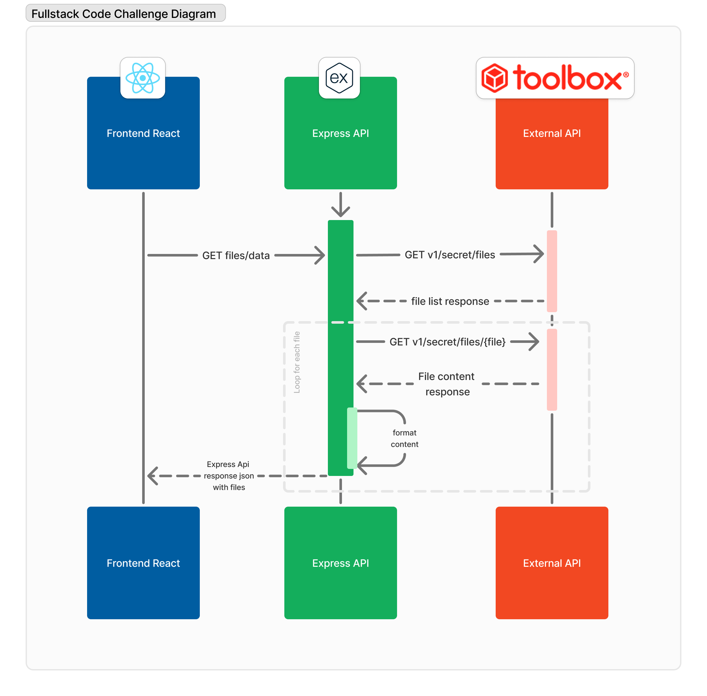
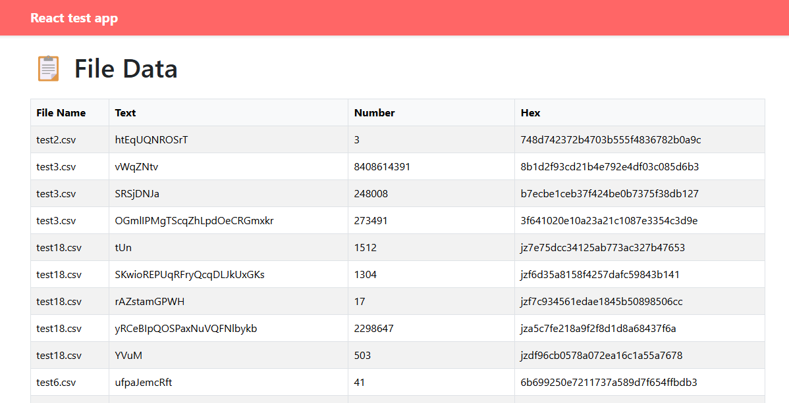
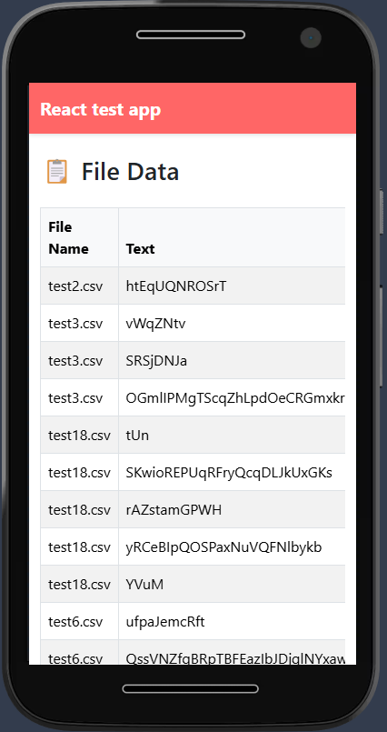

# Tbx Code Challenge

A modern full-stack JavaScript application demonstrating a seamless integration between an Express.js API backend and a React frontend, featuring responsive design and comprehensive test coverage.




### ⚠️ Caveats 
    -   builded in Node version - v16.20.2
    -   I decided not to use docker containers because they are not compatible with my current environment.


## Express API

The `express-api/` directory contains a Node.js API built with Express. This must be started first before running the frontend application.

### Setup and Run

```bash
cd express-api
npm install
npm start
```

The API will run on `http://localhost:3001`

### Running Tests

```bash
npm test
```

## React Frontend

The `frontend/` directory contains a React application that consumes the Express API.

### Setup and Run

```bash
cd frontend
npm install
npm start
```

The application will open in your browser at `http://localhost:3000`


## How the app look

### Desktop


### Mobile Responsive


